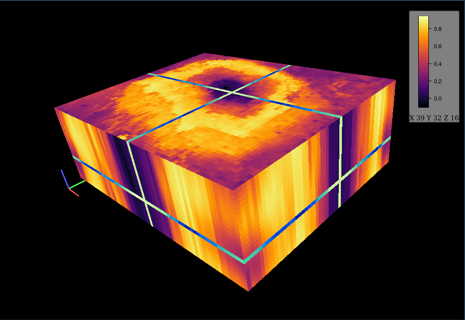

<!-- README.md is generated from README.Rmd. Please edit that file -->

```{r setup, include = FALSE}
knitr::opts_chunk$set(
  collapse = TRUE,
  eval = FALSE,
  comment = "#>",
  fig.path = "man/figures/README-",
  out.width = "100%"
)
```

# cubeview - Interactively Explore 3D Raster Data Cubes

[](https://cran.r-project.org/package=cubeview)
 [](https://travis-ci.org/r-spatial/cubeview)

`cubeview` enables interactive 3D exploration of raster data cubes.

## Installation

You can install the released version of cubeview from [CRAN](https://CRAN.R-project.org) with:

``` r
install.packages("cubeview")
```

## Example

``` r
library(raster)

kili_data <- system.file("extdata", "kiliNDVI.tif", package = "mapview")
kiliNDVI <- stack(kili_data)

cubeview(kiliNDVI)
```


### Code of Conduct

Please note that the 'leafpm' project is released with a [Contributor Code of Conduct](CODE_OF_CONDUCT.md). By participating in this project you agree to abide by its terms.

